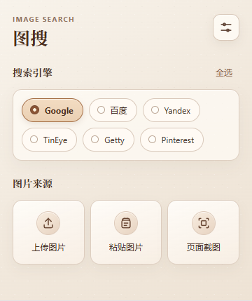

# Minimal Image Search

一款极简的 Chrome / Edge 以图搜索插件，支持多个搜索引擎。

## 界面预览

## 功能

- 可通过**上传本地图片**、**粘贴剪贴板图片**、**当前页面截图**三种方式进行图片搜索
- 可多选搜索引擎并同时搜索（设置页控制主界面显示哪些搜索引擎）
- 目前支持 Google、百度、Yandex、TinEye、Getty Images、Pinterest

## 安装

1. 下载或克隆本仓库
2. 打开 Chrome / Edge 扩展管理页
3. 开启开发者模式
4. 点击“加载已解压的扩展”
5. 选择包含 `manifest.json` 的项目文件夹
